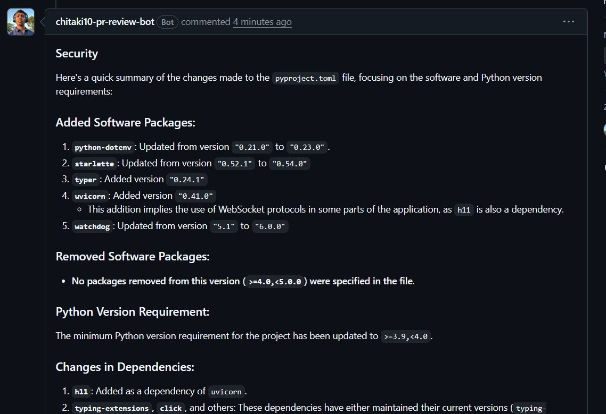
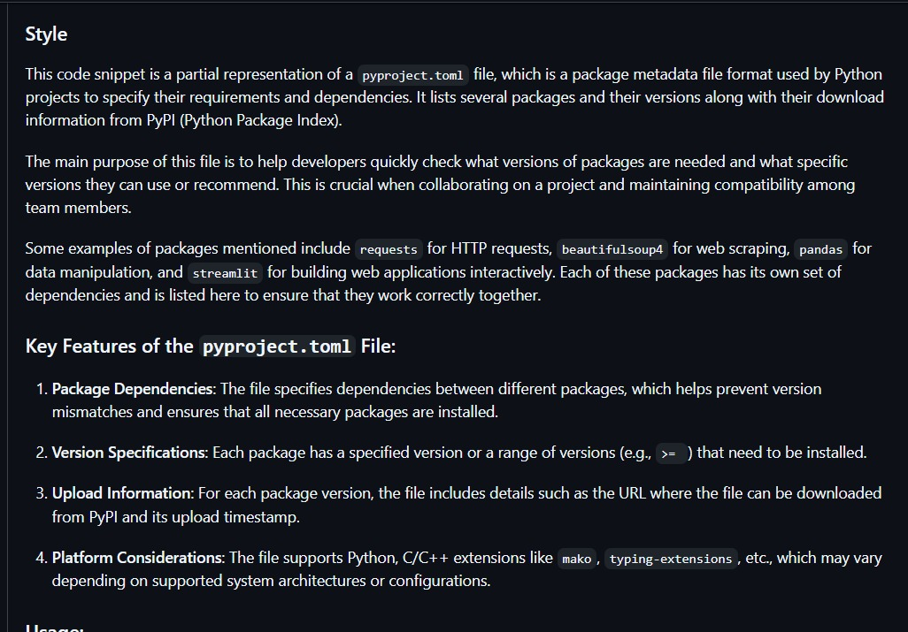
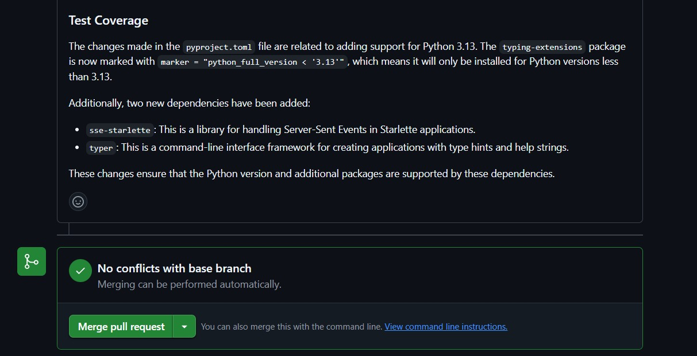
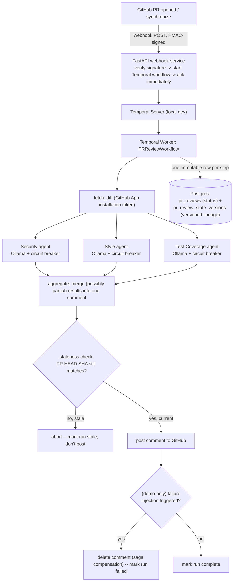

# Multi-Agent GitHub PR Review Bot


A self-hosted GitHub PR review bot: open or update a pull request, and the bot fans out to three specialized agents (Security, Style, Test Coverage), each backed by a locally-running open-weight LLM, merges their findings into one comment, and posts it back to the PR — durably. Built to demonstrate real distributed-systems patterns (durable workflow orchestration, versioned state, staleness handling, circuit breaking, saga compensation) around a multi-agent LLM pipeline. Fully open source, no hosted model APIs required.

## Demo

The bot commenting on a real pull request — one comment, three sections, each from its own agent:

| Security | Style | Test Coverage |
|---|---|---|
|  |  |  |

## Architecture



Text version of the same flow:

```
GitHub PR (opened/synchronize)
   │  webhook POST (HMAC-signed, GitHub App)
   ▼
FastAPI webhook-service — verifies signature, starts a Temporal workflow, acks immediately
   ▼
Temporal Server (local dev)
   ▼
Temporal Worker — hosts the PRReviewWorkflow + activities:
   ├─ fetch diff (GitHub App installation token)
   ├─ Security / Style / Test-Coverage agents — run concurrently, each Ollama
   │    call wrapped in its own circuit breaker (a tripped breaker → that
   │    section is skipped, not a hard failure)
   ├─ aggregate the (possibly partial) results into one markdown comment
   ├─ staleness check — re-fetch the PR's current HEAD SHA; abort without
   │    posting if it no longer matches this run's SHA
   ├─ post the comment
   ├─ (demo-only) failure-injection check — if triggered, delete the just-
   │    posted comment (saga compensation) and mark the run failed
   └─ track status transitions in Postgres (pending → running → complete
        / stale / failed)
```

## Stack

- **FastAPI** — webhook receiver
- **Temporal** (`temporalio`) — durable workflow orchestration, retries, concurrent activity fan-out
- **Postgres** (`asyncpg`) — versioned review state, keyed by `(repo, pr_number, head_sha)`
- **Ollama** — local, open-weight model serving (`qwen2.5-coder:3b`, swappable to vLLM later without touching agent code)
- **Circuit breaker** (`src/prbot/circuit_breaker.py`, hand-rolled, zero dependencies) — per-agent circuit breakers; originally `pybreaker`, replaced after it turned out to need `tornado` as an undeclared internal dependency for its async support
- **GitHub App** — scoped installation auth, not a personal access token

## Running locally

```bash
python -m venv .venv
.venv/Scripts/pip install -e ".[dev]"

docker-compose up -d          # Postgres
temporal server start-dev     # Temporal dev server + Web UI at localhost:8233

.venv/Scripts/python -m prbot.orchestration.worker      # Temporal worker
.venv/Scripts/uvicorn prbot.api.app:app --port 8000   # webhook server
```

Or, on Windows, use the demo script to start everything at once:

```powershell
.\scripts\demo.ps1 -SmeeUrl https://smee.io/your-channel-id
```

Add `-ForceFailureAfterPost` to demo Stage 6's saga compensation (posts a comment, then deletes it and marks the run failed).

You'll also need a GitHub App (webhook secret + private key) and a local tunnel (e.g. `smee-client`) pointed at `/webhook` for GitHub to reach your machine, plus `ollama pull qwen2.5-coder:3b`. Copy `.env.example` to `.env` and fill in the values.

**Known local-machine gotcha:** if you have other services (native Postgres installs, other Docker containers, WSL-forwarded ports) already bound to the ports this project wants (5432 for Postgres, 8000 for the webhook), `localhost` can silently resolve to the wrong listener. Prefer `127.0.0.1` explicitly over `localhost` when pointing tools (like `smee-client`) at this project's webhook, and remap `docker-compose.yml`'s Postgres port if 5432 is taken — see `docs/superpowers/plans/2026-07-19-stage2-verification.md` for the specific issue this project hit.

## Testing

```bash
.venv/Scripts/pytest -v
```
